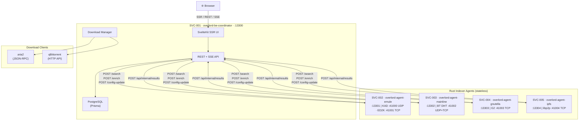

# p2p-overlord

> Multi-protocol P2P indexer. Crawls KAD, ED2K, BitTorrent DHT, Gnutella G2, and IPFS 24/7.
> Aggregates metadata into a unified PostgreSQL index with cross-protocol deduplication.

See [OVERLORD.md](OVERLORD.md) for the full specification.

---

## About

`p2p-overlord` is a microservices system that passively and actively harvests file metadata from five P2P networks simultaneously — KAD, ED2K, BitTorrent DHT, Gnutella G2, and IPFS. It runs a coordinator service (SvelteKit/Node.js) that owns the PostgreSQL database, exposes a unified REST API and server-rendered frontend, and orchestrates a fleet of stateless Rust indexer agents — one per protocol. Indexers only need to know the coordinator URL; the coordinator handles job dispatch, config push, cross-protocol deduplication, and download management via aria2 or qBittorrent. The same file found across multiple networks collapses into a single database record with multiple source sets. Designed to run on one machine and scale out horizontally.

---

## Architecture

---

## How it works

| Layer | What it does |
|---|---|
| **Coordinator** (Node.js) | Owns the database, exposes the public REST API and SSR frontend, dispatches jobs to indexers, manages downloads via Metalink 4 |
| **Indexer agents** (Rust) | Stateless protocol daemons — only need `OVERLORD_COORDINATOR_URL`. Run one or many instances per protocol |
| **Cross-protocol dedup** | Same file found on multiple networks → one DB record, multiple source sets. Same file in multiple torrents → one canonical record |
| **Always crawling** | Passive crawl runs 24/7 regardless of user activity |
| **Active search** | User queries fan out to all registered indexer instances simultaneously |
| **Download** | Coordinator generates Metalink 4 files combining all known hashes/sources and hands them to aria2 or qBittorrent |

## Services

| ID | Package | Port | P2P |
|---|---|---|---|
| SVC-001 | `overlord-be-coordinator` | 13300 | — |
| SVC-002 | `overlord-agent-emule` | 13301 | 41000 UDP (KAD), 41001 TCP (ED2K) |
| SVC-003 | `overlord-agent-mainline` | 13302 | 41002 UDP+TCP (BT DHT) |
| SVC-004 | `overlord-agent-gnutella` | 13303 | 41003 TCP (G2) |
| SVC-005 | `overlord-agent-ipfs` | 13304 | 41004 TCP (libp2p) |

All ports are configurable via the central TOML. See [OVERLORD.md](OVERLORD.md) for configuration, the full phase roadmap, API reference, and database schema.
